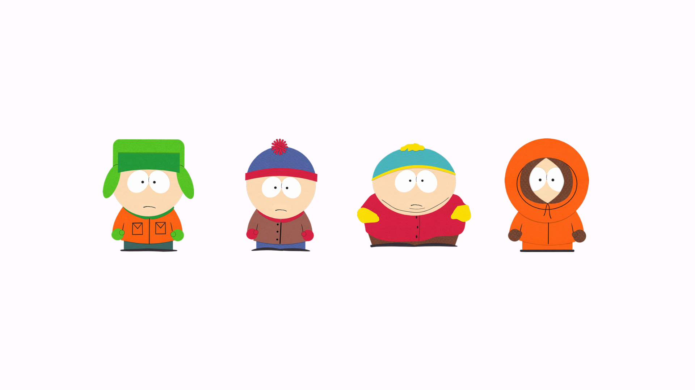
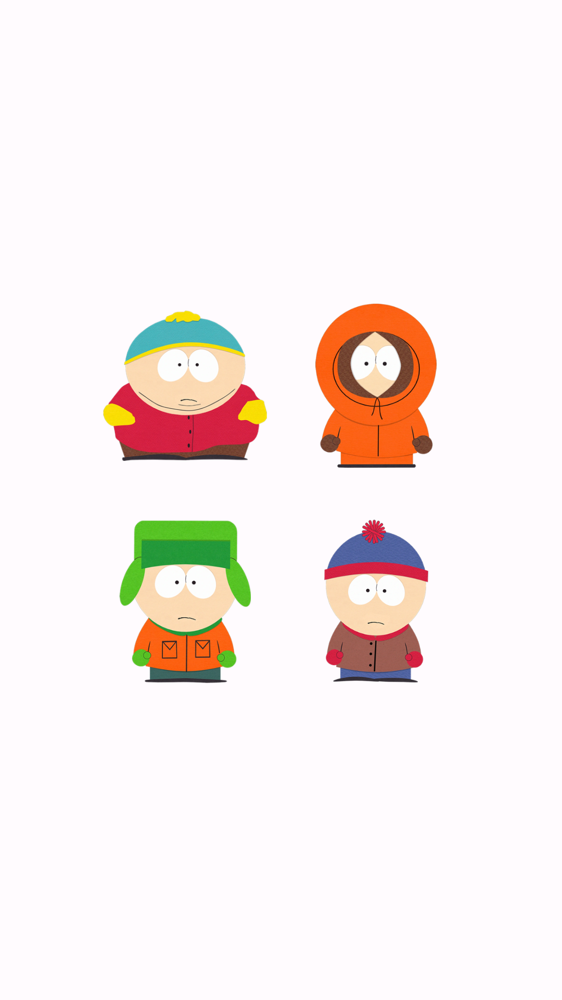

# ResponsiveSouthPark App

This Android application, ResponsiveSouthPark, provides a responsive user interface that adapts to different screen orientations. The layout differs when the device is in landscape (horizontal) mode compared to portrait (vertical) mode.

## Features

- Responsive design that adjusts the layout based on screen orientation.
- Displays different views in landscape and portrait modes.

## Usage

1. Clone the project to your computer or download it as a ZIP file.

    ```bash
    git clone https://github.com/josephnade/responsiveSouthPark.git
    cd responsive-south-park
    ```

2. Open the project in Android Studio or another suitable Android development environment.

3. Run the application on an Android device or emulator.

4. Observe the layout changes when switching between landscape and portrait modes.

## Screenshots

### Landscape Mode (Horizontal)


### Portrait Mode (Vertical)


## Technologies

- Java
- Android Studio

## Responsive Design

The app utilizes responsive design techniques to provide an optimized layout for both landscape and portrait orientations.

## Contribution

Contributions and feedback are welcome. If you have questions or suggestions, please [contact us](mailto:example@mail.com).

---

We hope this documentation helps you understand and utilize the ResponsiveSouthPark app effectively. Enjoy the responsive experience! 📱
